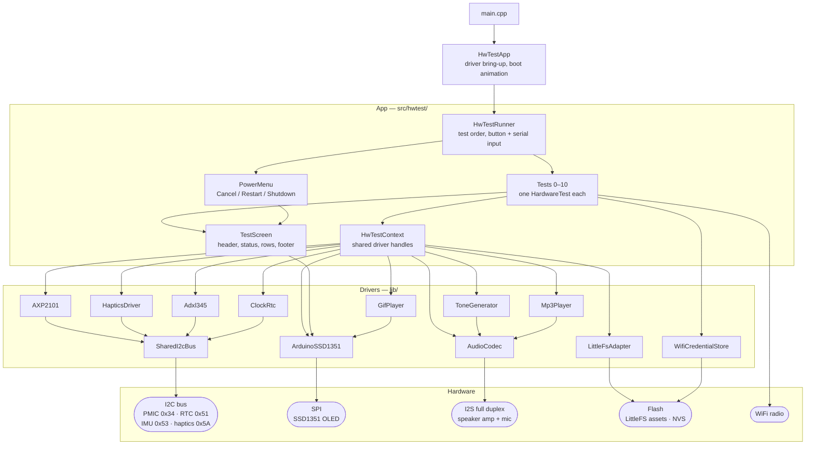

# BYTE-90 Hardware Test Firmware

**Board bring-up and hardware check firmware for the BYTE-90 interactive designer art toy**

`byte90-hardware-demo`, on `main`, strips the BYTE-90 firmware down to a
hardware tester. It boots with the BYTE-90 DOS animation and startup GIF, then steps
through one test per peripheral, one button click at a time. Each test shows
yellow **Test started**, its readings, then green **Done** or red **FAIL**.

It is meant for new board bring-up, post-assembly checks, and diagnosing a
faulty unit. It has no product behavior: no portal, clock, sleep, or AI.

Product information: [BYTE-90 by ALXV Labs](https://labs.alxvtoronto.com/)

> This project provides firmware only. Proprietary animations, original designs, branding, and 3D printed files are **not included** in this repository.

---

## ⚠️ Important for BYTE-90 Device Owners

**This firmware is not compatible with Series 1 BYTE 90 devices. Series 2 owners will require a Series 2 AI ready PCB upgrade kit**.
Flashing custom firmware to a purchased BYTE-90 device may:

- Cause loss of proprietary animations and visual effects stored in flash  
- Create incompatibility with specific hardware revisions  
- Lead to boot issues or device malfunction  

Flashing the hardware tester replaces the product firmware. Reflash an official
release to get normal BYTE-90 behavior back.

---

## 🧪 What It Tests

| # | Test | Hardware |
| --- | --- | --- |
| 0 | Startup GIF (runs once at power-on) | Display, LittleFS, GIF decode, speaker |
| 1 | Display | SSD1351 OLED over SPI |
| 2 | Button | Power key via AXP2101 IRQ: click, double-click, hold |
| 3 | Power / I2C | I2C bus scan, AXP2101 rails, USB, charger |
| 4 | Haptics | DRV2605L and ERM motor |
| 5 | IMU | ADXL345 accelerometer, tap and tilt |
| 6 | Sound | MAX98357A speaker amp: tones and MP3 |
| 7 | Mic | ICS-43434: record, level meter, playback |
| 8 | WiFi | Scan; join and NTP if credentials are saved |
| 9 | RTC | PCF8563 tick; NTP write-back |
| 10 | Battery | AXP2101 fuel gauge readout, charge state, USB unplug/replug detection |

How to run each test, what passes, and what a failure means:
[HARDWARE_TEST_GUIDE.md](docs/HARDWARE_TEST_GUIDE.md).

---

## 🧭 How It Works

### Architecture

`HwTestApp` brings up every driver once and hands them to the tests through a
shared `HwTestContext`. `HwTestRunner` owns the test order, the button and
serial input, and the power menu; each test only draws through `TestScreen`.



### Test flow

The boot sequence, the test cycle, and the button and power-menu controls are
diagrammed in the [hardware test guide](docs/HARDWARE_TEST_GUIDE.md#2-run).

---

## 🛠 Getting Started

### Prerequisites

- **pioarduino IDE** VS Code extension (`pioarduino.pioarduino-ide`), the
  toolchain this project targets. It is listed in `.vscode/extensions.json`, so
  VS Code offers it when you open the repo.
- Python 3.7+
- Git
- USB-C cable

Do not build this project with the PlatformIO IDE extension or PlatformIO's
bundled `espressif32` platform. pioarduino is a separate fork with its own
toolchain, and the two are not interchangeable here.

### Platform: pioarduino, not upstream espressif32

This project builds against
[pioarduino/platform-espressif32](https://github.com/pioarduino/platform-espressif32),
a community fork that tracks current Arduino-ESP32 and ESP-IDF releases for the
ESP32-S3. `platformio.ini` pins the platform to a pioarduino release archive,
so building with `platform = espressif32` is not supported.

### Build And Flash

```sh
pio run -t upload        # build and flash firmware
pio run -t uploadfs      # flash the startup GIF and test sounds
pio device monitor       # serial monitor at 115200
```

Flash the filesystem on a first install, or after changing anything under
`data/`.

There is no setup portal. For the WiFi test, either type
`wifi <ssid> <password>` in the serial monitor, or set `WIFI_TEST_SSID` and
`WIFI_TEST_PASSWORD` in `lib/system/DeviceConfig.h`; see the
[guide](docs/HARDWARE_TEST_GUIDE.md) for keeping those out of git.

### Required Libraries

```ini
lib_deps =
    lewisxhe/XPowersLib@^0.3.1                     # AXP2101 PMIC
    adafruit/Adafruit GFX Library@^1.11.11         # Graphics primitives
    adafruit/Adafruit SSD1351 library@^1.3.2       # OLED display driver
    adafruit/Adafruit DRV2605 Library@^1.2.4       # Haptics
    adafruit/Adafruit Unified Sensor@^1.1.15       # Sensor base types
    adafruit/RTClib@^2.1.4                         # PCF8563 RTC
    bitbank2/AnimatedGIF@^2.2.0                    # GIF decoding
```

The ADXL345 accelerometer driver is in-tree at `lib/adxl/`, not a dependency.

Coredumps produced by the `coredump` partition are decoded with
`scripts/decode_coredump.sh`.

---

## 🔋 Device Safety

### Battery Safety

- ⚠️ **Check connector polarity alignment carefully**
- ⚠️ DO NOT connect battery into the speaker connector
- Use ONLY the specified 3.7V lithium battery (103040 size) with PH 2.0 connector
- Verify 3.7V voltage (NOT 3.9V) before installation
- Handle battery connector with care to avoid damage

### Environmental Safety

**BYTE-90 is designed as a desktop device for indoor use only.**

- ⚠️ Do NOT use in vehicles or automotive environments - Heat, temperature fluctuations, and vibrations in cars can cause device overheating, battery damage, or malfunction.
- ⚠️ Avoid high-temperature environments - Operating temperature should remain below 35°C (95°F) to prevent overheating.
- ⚠️ Keep away from direct sunlight - Prolonged sun exposure can cause overheating and display damage.

---

## 📚 Documentation

Start at [docs/README.md](docs/README.md):

- [HARDWARE_TEST_GUIDE.md](docs/HARDWARE_TEST_GUIDE.md) — flashing, running, and reading each test
- [BYTE90_HARDWARE_SPECS.md](docs/BYTE90_HARDWARE_SPECS.md) — pins, buses, power rails
- [CODING_STYLE_GUIDE.md](docs/CODING_STYLE_GUIDE.md)

---

## Acknowledgements

- **Adafruit Industries**: Hardware libraries and sensor drivers
- **Bitbank2**: AnimatedGIF library for efficient GIF rendering
- **Espressif Systems**: ESP32 development framework and tools
- **Seeedstudio**: XIAO ESP32S3 development board design
- **Community Contributors**: Open source development and testing

## 🤝 Contributing & Legal

Firmware is licensed under **GPL v3.0**.

BYTE-90 branding, animations, visual identity, and 3D models are proprietary assets of ALXV Labs.

Full legal terms, contribution rules, branding restrictions, and commercial-use policies: **see `CONTRIBUTING.md`** [CONTRIBUTING.md](CONTRIBUTING.md)

---

*Designed and developed by Alex Vong, ALXV LABS.*
