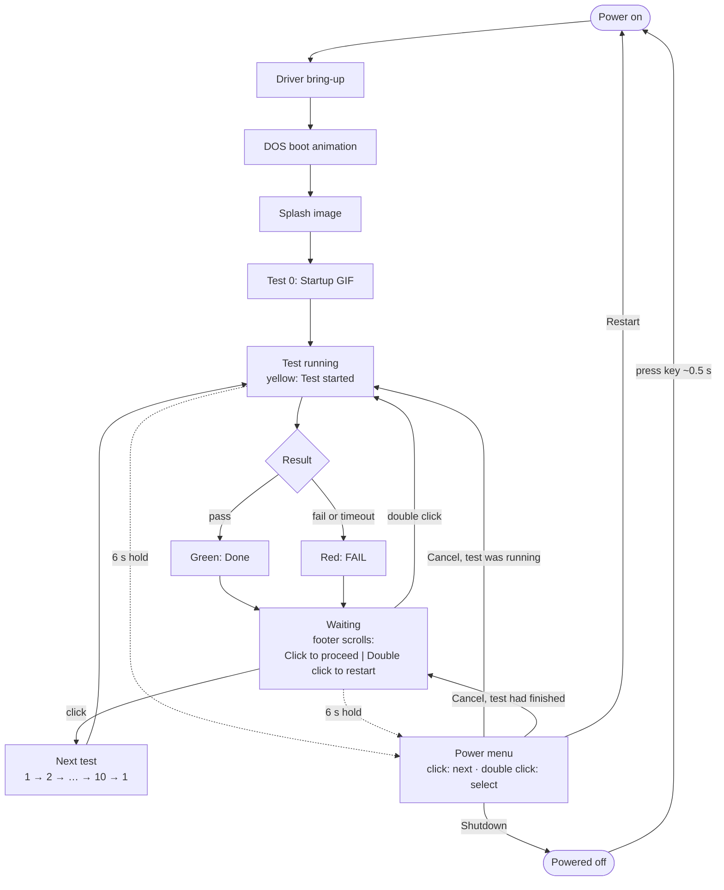

# Hardware Test Guide

**Scope:** flashing and running the BYTE-90 hardware test firmware, what each
test checks, and how to read a failure.

**Source of truth:** `src/hwtest/`. Pass thresholds live as constants at the
top of each `src/hwtest/tests/*Test.cpp`.

**Read this when:** bringing up a new board, checking a unit after assembly, or
adding or tuning a test.

| Related | Covers |
| --- | --- |
| [`BYTE90_HARDWARE_SPECS.md`](./BYTE90_HARDWARE_SPECS.md) | Pins, buses, I2C addresses, power rails |

---

## 1. Flash

```sh
PIO=~/.platformio/penv/bin/platformio

$PIO run -e seeed_xiao_esp32s3 -t upload     # firmware
$PIO run -e seeed_xiao_esp32s3 -t uploadfs   # assets: startup GIF + 2 sounds
$PIO device monitor -b 115200                # optional, shows every result
```

Flash the filesystem on every board that last ran the full firmware. Without
it, test 0 fails with `GIF file missing` and the sound test's MP3 step fails.

---

## 2. Run

At power-on the board plays the DOS boot animation and splash, then runs
**test 0 (startup GIF)** once. After that, each click advances one test; after
test 10 it wraps to test 1.

Solid arrows are the normal flow; dotted arrows are a 6 s hold, which works
from any test.



Every test page looks the same:

| Area | Shows |
| --- | --- |
| Header | `03/10 POWER/I2C`: test number and name |
| Status | Yellow **Test started**, then green **Done** or red **FAIL** |
| Body | `Label:` on the left, value right-aligned in its status colour; plain lines are instructions or the verdict |
| Footer | Scrolling hint once the test has finished: *Click to proceed \| Double click to restart* |

### Controls

| Input | While a test runs | After it finishes |
| --- | --- | --- |
| Click power key | Ignored (except in the button test) | Next test, after ~0.5 s |
| Double-click power key | Ignored (except in the button test) | Restart this test |
| Serial `n` | Skip it (logged as SKIP) | Next test |
| Serial `r` | Restart it | Restart it |
| Serial `s` | Print the result summary | Same |
| Serial `wifi <ssid> <password>` | Save WiFi credentials to NVS | Same |

A single click acts about half a second after you press it: the firmware
waits that long to be sure it is not the first half of a double click.

Holding the key does nothing between tests; a 1 s hold is only an input
inside the button test, where the board buzzes the moment it registers.

### Power Menu

Hold the key for **6 s**, at any point, to open the power menu:

| Option | Does |
| --- | --- |
| Cancel | Closes the menu. A test that was running restarts; a finished test's result page comes back |
| Restart | Restarts the firmware (boot animation, then test 0) |
| Shutdown | Powers the board off through the PMIC; press the key about 0.5 s to power back on |

Click moves the highlight; double click selects. The menu always opens on
**Cancel**. The serial `n` and `r` commands are ignored while it is open.

The PMIC's own hold-to-power-off is disabled in this firmware, so the menu is
the only way to switch off from the key. If the firmware hangs, press the
XIAO's reset button, or disconnect the battery. If Shutdown shows
*Could not power off*, USB is keeping the board powered: unplug it and try
again.

---

## 3. Tests

| # | Test | What you do | Passes when | Times out |
| --- | --- | --- | --- | --- |
| 0 | Startup GIF | Watch and listen | GIF plays to the end, sound plays | 20 s |
| 1 | Display | Watch the red/green/blue/white/black fills, gradient, border | Always *Done*; **you** judge dead pixels, uneven colour, or a missing border edge | — |
| 2 | Button | Click 3 times with a pause between, double-click, then hold until it buzzes and let go | All three steps are detected, in order | 40 s |
| 3 | Power / I2C | Nothing | All four I2C devices answer (0x34, 0x51, 0x53, 0x5A) and DCDC1 is on at 3.0-3.6 V | — |
| 4 | Haptics | Feel five effects | Every effect write succeeds; **you** confirm you felt all five | — |
| 5 | IMU | Tap the device, and tilt it | Resting magnitude reads 8.0-11.8 m/s², and both a tap and a 6 m/s² tilt are seen | 20 s |
| 6 | Sound | Listen: 440, 1000, 2000 Hz tones, then `ding.mp3` | All four play; **you** confirm you heard them | 6 s for the MP3 |
| 7 | Mic | Speak after the countdown; 3 s recording then playback | Peak ≥ 200. A yellow *Quiet* or *Hot* line is advice, not a failure | — |
| 8 | WiFi | Nothing | Scan finds at least one network; if credentials are saved, it must also join | 15 s scan, 15 s join |
| 9 | RTC | Nothing | RTC advances 1-4 s over a 2.5 s window; if WiFi joined, the NTP time is written and reads back within 2 s | 10 s for NTP |
| 10 | Battery | Wait 6 s, then unplug USB and plug it back in when prompted (the reverse order if it started on battery) | A cell is detected, stays within 3.0-4.35 V, and the PMIC sees both USB changes | 30 s per USB step |

Tests 1, 4, 6, and 7 print a *Done* the firmware cannot fully verify.
Treat what you saw, felt, or heard as the real result.

Test 8 leaves WiFi connected so test 9 can sync time, and test 10 reads the
battery under that radio load.

### Reading the battery test

The AXP2101 has no current sensor, so no test can show charge or discharge
current. Test 10 shows what the chip does report:

| Line | Meaning |
| --- | --- |
| `Charge: CC <=400mA` | Charging, in the constant-current (`CC`), constant-voltage (`CV`), `pre`-charge or trickle (`trkl`) phase; `400mA` is the configured limit, not a measurement |
| `Charge: no, on batt` | The battery is powering the board |
| `Charge: done (full)` / `idle` | USB present, battery not charging |
| `Trend: +12 mV / 6 s` | Cell voltage change during sampling: rising while charging, falling on battery |
| `Unplug: OK, -120 mV` | The PMIC saw USB removed; the number is the drop from the last USB reading to battery alone |
| `Plug in: OK, charging` | USB returned and charging resumed (`full` is also a pass) |

Unplugging USB drops the serial monitor connection; the board keeps running on
battery. If no battery is detected, the test fails before asking you to unplug.

---

## 4. WiFi Credentials

There is no setup portal. Test 8 takes credentials from the first of these
that is set:

1. **Hardcoded:** `WIFI_TEST_SSID` / `WIFI_TEST_PASSWORD` in
   `lib/system/DeviceConfig.h`, or the same names as build flags. Handy when
   flashing many boards on one network.
2. **Saved in NVS:** send over serial, then rerun test 8:

   ```text
   wifi MyNetwork my password with spaces
   ```

   Everything after the SSID is the password. These persist across reflashes,
   and are shared with the product firmware.

Without either, test 8 only scans and test 9 skips the NTP write. The serial
log says which source was used: `Joining 'MyNetwork' from DeviceConfig.h`.

Do not commit real credentials in `DeviceConfig.h`. To keep them out of git
entirely, leave the defines empty and pass them through the environment for
the build (PlatformIO appends `PLATFORMIO_BUILD_FLAGS` to the build flags):

```sh
export PLATFORMIO_BUILD_FLAGS='-DWIFI_TEST_SSID=\"MyNetwork\" -DWIFI_TEST_PASSWORD=\"secret\"'
$PIO run -e seeed_xiao_esp32s3 -t upload
```

---

## 5. Serial Output

Everything on the screen also goes to serial at 115200, so a run can be
debugged from the log alone.

| Logged at INFO (default) | Example |
| --- | --- |
| Driver bring-up | `HwTestApp: ADXL345 ready` / `failed to initialize` |
| Test start, every result row, outcome | `==== [3/10] POWER/I2C: Test started ====`, `0x34 AXP2101: OK`, `==== ... Done ====` |
| Outcome and duration | `HwTestRunner: POWER/I2C: PASS after 812 ms` |
| Every button event, with context | `Button: double click (test finished, BUTTON)` |
| Serial commands received | `Serial command: n` (WiFi passwords are never logged) |
| Power menu | `Power menu opened`, `Highlight: Restart`, `Selected: Cancel` |
| Detection moments | IMU `Tap detected`, `Tilt detected on Z`; battery `USB unplugged after 3120 ms` |
| Progress in long steps | mic peak every 0.5 s while recording; WiFi join time |
| Detail the screen cannot fit | full WiFi scan list with channel and security; IMU per-axis ranges |

```text
I (5120) TestScreen: ==== [3/10] POWER/I2C: Test started ====
I (5925) TestScreen:   0x34 AXP2101: OK
I (5926) TestScreen:   0x51 PCF8563: OK
...
I (5931) TestScreen: ==== [3/10] POWER/I2C: Done ====
I (5931) HwTestRunner: POWER/I2C: PASS after 811 ms
```

After test 10, or on `s`, the runner prints one PASS / FAIL / SKIP / `-` line
per test and an `N/11 passed` total.

Live values that refresh on screen (IMU axes, mic level, battery readout,
countdowns) are logged at VERBOSE, and only when they change, so they do not
flood the console. To see them, build with `-DCORE_DEBUG_LEVEL=5` in
`platformio.ini`.

---

## 6. Troubleshooting

| Symptom | Likely cause |
| --- | --- |
| Screen stays black; serial shows `Display failed` | SPI wiring or panel; the TPS3823 supervisor holds reset while 3V3 is low |
| Test 0: `GIF file missing` or `LittleFS not mounted` | Filesystem not flashed; run `uploadfs` |
| Test 3: one address shows `missing` | That device is not answering: check its solder joints and the shared SDA/SCL |
| Every I2C test fails | Shared bus fault (SDA D4 / SCL D5) or PMIC not powering the rail |
| Test 7: `Mic silent / dead` | ICS-43434 data line D0, or mic not soldered; if test 6 also failed, suspect shared BCLK/LRCLK |
| Test 9: tick outside 1-4 s | PCF8563 crystal not oscillating |
| Test 10: `No battery detected` | Battery unplugged or connector reversed; see the README battery safety notes |
| Test 10: `Unplug: not seen` or `Plug in: not seen` | VBUS sensing on the AXP2101, or the USB-C connector |
| Test 10: `PMIC not discharging` after unplug | Battery path (BATFET) not taking over from USB |
| No reaction to clicks | Use serial `n` to continue; the button test will confirm whether the key or IRQ line is at fault |

---

## 7. Code Map

| Path | Holds |
| --- | --- |
| `src/main.cpp` | Entry point; starts `HwTestApp` |
| `src/hwtest/HwTestApp.*` | Driver bring-up, DOS boot animation, splash |
| `src/hwtest/HwTestRunner.*` | Test order, button and serial handling, summary |
| `src/hwtest/TestScreen.*` | Header/status/body/footer layout |
| `src/hwtest/HardwareTest.h` | Test contract: `start()`, `update()`, `finish()` |
| `src/hwtest/tests/` | One class per test |

To add a test:

1. Subclass `HardwareTest`.
2. Keep `update()` non-blocking, apart from short audio writes.
3. Return `PASSED` or `FAILED` when it is finished.
4. Add it to the `_tests` list in `HwTestRunner.cpp` and bump `TEST_COUNT`.
